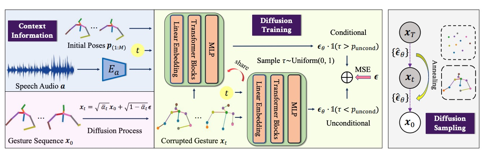

# Taming Diffusion Models for Audio-Driven Co-Speech Gesture Generation (CVPR 2023)

This is the official code for [**Taming Diffusion Models for Audio-Driven Co-Speech Gesture Generation**](https://arxiv.org/abs/2303.09119).

## Abstract

Animating virtual avatars to make co-speech gestures facilitates various applications in human-machine interaction. The existing methods mainly rely on generative adversarial networks (GANs), which typically suffer from notorious mode collapse and unstable training, thus making it difficult to learn accurate audio-gesture joint distributions. In this work, we propose a novel diffusion-based framework, named **Diffusion Co-Speech Gesture (DiffGesture)**, to effectively capture the cross-modal audio-to-gesture associations and preserve temporal coherence for high-fidelity audio-driven co-speech gesture generation. Specifically, we first establish the diffusion-conditional generation process on clips of skeleton sequences and audio to enable the whole framework. Then, a novel Diffusion Audio-Gesture Transformer is devised to better attend to the information from multiple modalities and model the long-term temporal dependency. Moreover, to eliminate temporal inconsistency, we propose an effective Diffusion Gesture Stabilizer with an annealed noise sampling strategy. Benefiting from the architectural advantages of diffusion models, we further incorporate implicit classifier-free guidance to trade off between diversity and gesture quality. Extensive experiments demonstrate that DiffGesture achieves state-of-the-art performance, which renders coherent gestures with better mode coverage and stronger audio correlations.



## Installation & Preparation

1. Clone this repository and install packages:
    ```
    git clone https://github.com/Advocate99/DiffGesture.git
    pip install -r requirements.txt
    ```

2. Download pretrained fasttext model from [here](https://dl.fbaipublicfiles.com/fasttext/vectors-english/crawl-300d-2M-subword.zip) and put `crawl-300d-2M-subword.bin` and `crawl-300d-2M-subword.vec` at `data/fasttext/`.

3. Download the autoencoder used for FGD which include the following:

    For the TED Gesture Dataset, we use the pretrained Auto-Encoder model provided by Yoon et al. for better reproducibility [the ckpt in the train_h36m_gesture_autoencoder folder](https://kaistackr-my.sharepoint.com/:u:/g/personal/zeroyy_kaist_ac_kr/Ec1UIsDDLHtKia04_TTRbygBepXORv__kkq-C9IqZs32aA?e=bJGXQr).

    For the TED Expressive Dataset, the pretrained Auto-Encoder model is provided [here](https://mycuhk-my.sharepoint.com/:u:/g/personal/1155165198_link_cuhk_edu_hk/EWbBxUeuIHFDnBUgZFMCq1oBdiZSw6pOlmVxC8d9xS3HOg?e=IT1AoC).

    Save the models in `output/train_h36m_gesture_autoencoder/gesture_autoencoder_checkpoint_best.bin` for TED Gesture, and `output/TED_Expressive_output/AE-cos1e-3/checkpoint_best.bin` for TED Expressive.

4. Refer to [HA2G](https://github.com/alvinliu0/HA2G) to download the two datasets.

5. The pretrained models can be found [here](https://connecthkuhk-my.sharepoint.com/:u:/g/personal/ltzhu99_connect_hku_hk/EVE9MqI18k5FmsavVFESaVAB2lrv5e1CiHhr20xW2Vd5cA?e=eU6e4t).

## Training

While the test metrics may vary slightly, overall, the training procedure with the given config files tends to yield similar performance results and normally outperforms all the comparison methods.

```
python scripts/train_ted.py --config=config/pose_diffusion_ted.yml
python scripts/train_expressive.py --config=config/pose_diffusion_expressive.yml
```

## Inference
```
# synthesize short videos
python scripts/test_ted.py short
python scripts/test_expressive.py short

# synthesize long videos
python scripts/test_ted.py long
python scripts/test_expressive.py long

# metrics evaluation
python scripts/test_ted.py eval
python scripts/test_expressive.py eval
```

## Citation

If you find our work useful, please kindly cite as:
```
@article{zhu2023taming,
  title={Taming Diffusion Models for Audio-Driven Co-Speech Gesture Generation},
  author={Zhu, Lingting and Liu, Xian and Liu, Xuanyu and Qian, Rui and Liu, Ziwei and Yu, Lequan},
  journal={arXiv preprint arXiv:2303.09119},
  year={2023}
}
```

## Related Links
If you are interested in **Audio-Driven Co-Speech Gesture Generation**, we would also like to recommend you to check out our other related works:

* Hierarchical Audio-to-Gesture, [HA2G](https://alvinliu0.github.io/projects/HA2G).

* Audio-Driven Co-Speech Gesture Video Generation, [ANGIE](https://alvinliu0.github.io/projects/ANGIE).

## Acknowledgement
* The codebase is developed based on [Gesture Generation from Trimodal Context](https://github.com/ai4r/Gesture-Generation-from-Trimodal-Context) of Yoon et al, [HA2G](https://github.com/alvinliu0/HA2G) of Liu et al, and [Diffusion Probabilistic Models for 3D Point Cloud Generation](https://github.com/luost26/diffusion-point-cloud) of Luo et at.